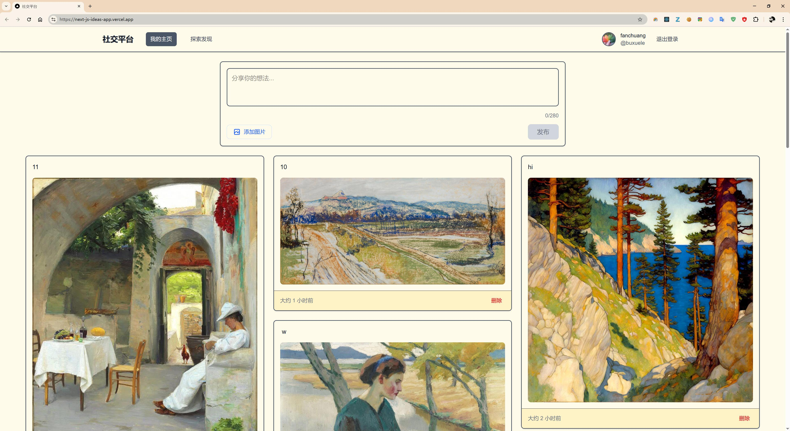

# 社交平台




基于 Next.js 15 和 GitHub 认证的现代化社交分享平台，支持文本和图片分享。

## ✨ 功能特色

- 🔐 **GitHub OAuth 认证** - 一键登录，无需注册
- 📝 **文本分享** - 支持 280 字符限制的文本内容
- 🖼️ **图片分享** - 最多上传 5 张图片，自动压缩优化
- 📱 **响应式设计** - 完美适配桌面和移动设备
- 🎨 **3 列瀑布流布局** - 独特的个人主页展示方式
- 🔍 **探索发现** - 浏览其他用户的精彩内容
- 🎯 **简洁界面** - 推特风格的简约设计

## 🖥️ 界面预览 
## 🚀 技术栈

### 前端

- **Next.js 15** - React 全栈框架，使用 App Router
- **React 19** - 最新的 React 版本
- **TypeScript** - 类型安全的 JavaScript
- **Tailwind CSS v4** - 现代化的 CSS 框架
- **React Hook Form** - 高性能表单处理
- **date-fns** - 日期处理库

### 后端

- **NextAuth.js v5** - 认证解决方案
- **Neon PostgreSQL** - 现代化的 PostgreSQL 云数据库
- **Zod** - TypeScript 优先的数据验证

### 部署

- **Vercel** - 无服务器部署平台
- **GitHub OAuth** - 第三方认证服务

## 🛠️ 快速开始

### 环境要求

- Node.js 18+
- npm 或 yarn
- GitHub 账户（用于 OAuth 配置）
- Neon 数据库账户

### 1. 克隆项目

```bash
git clone https://github.com/your-username/next-js-ideas-app.git
cd next-js-ideas-app
```

### 2. 安装依赖

```bash
npm install
```

### 3. 环境变量配置

复制环境变量模板：
```bash
cp .env.local.example .env.local
```
 

# 认证配置

NEXTAUTH_URL=http://localhost:7000
NEXTAUTH_SECRET=your-secret-key

# GitHub OAuth

GITHUB_ID=your-github-app-id
GITHUB_SECRET=your-github-app-secret


### 4. 数据库设置

参考 `docs/neon-setup.md` 配置 Neon 数据库，并在 SQL 编辑器中执行：

```sql
-- 执行 docs/database-schema.sql 中的建表语句
```

### 5. GitHub OAuth 配置

参考 `docs/github-oauth-setup.md` 配置 GitHub OAuth 应用。

### 6. 启动开发服务器

```bash
npm run dev
```

访问 [http://localhost:7000](http://localhost:7000) 查看应用。

## 📁 项目结构

```bash
├── app/ # Next.js App Router
│ ├── (auth)/ # 认证相关页面
│ │ └── login/ # 登录页面
│ ├── (dashboard)/ # 主应用页面
│ │ ├── page.tsx # 个人主页（3 列布局）
│ │ ├── explore/ # 探索发现页面
│ │ └── layout.tsx # 认证布局
│ ├── api/ # API 路由
│ │ ├── auth/ # NextAuth.js 路由
│ │ ├── posts/ # 帖子相关 API
│ │ └── images/ # 图片相关 API
│ ├── globals.css # 全局样式
│ └── layout.tsx # 根布局
├── components/ # React 组件
│ ├── layout/ # 布局组件
│ │ └── Navigation.tsx # 导航栏
│ ├── posts/ # 帖子相关组件
│ │ ├── PostCreationForm.tsx # 发帖表单
│ │ ├── PostCard.tsx # 帖子卡片
│ │ └── ThreeColumnLayout.tsx # 3 列布局
│ └── ui/ # UI 组件
│ ├── Toast.tsx # 通知组件
│ └── OptimizedImage.tsx # 优化图片组件
├── lib/ # 工具库
│ ├── auth.ts # NextAuth.js 配置
│ ├── db/ # 数据库相关
│ ├── validations.ts # 数据验证
│ └── image-utils.ts # 图片处理工具
├── docs/ # 文档
│ ├── neon-setup.md # Neon 数据库配置指南
│ ├── github-oauth-setup.md # GitHub OAuth 配置指南
│ └── database-schema.sql # 数据库建表语句
└── types/ # TypeScript 类型定义
```

## 🎨 设计特色

### 独特的 3 列布局

- 个人主页采用瀑布流 3 列展示，最大化内容展示
- 移动端自动适配为单列布局
- 内容占据浏览器 95% 宽度，充分利用屏幕空间

### 推特风格的交互

- 简洁的发帖界面，推特风格的图片上传按钮
- 280 字符限制，实时字符计数
- 优雅的 Toast 通知系统

### 暖色调设计

- 暖白色背景，减少视觉疲劳
- 琥珀色边框和强调色
- 现代化的卡片式设计

## 🚀 部署

### Vercel 部署

1. 连接 GitHub 仓库到 Vercel
2. 配置环境变量（参考上面的环境变量配置）
3. 为生产环境创建新的 GitHub OAuth 应用
4. 部署完成

### 环境变量（生产环境）

```bash
NEXTAUTH_URL=https://your-domain.vercel.app
NEXTAUTH_SECRET=your-production-secret
GITHUB_ID=your-production-github-id
GITHUB_SECRET=your-production-github-secret
DATABASE_URL=your-neon-database-url
```

## 📝 开发说明

### 主要特性

- 使用 TypeScript 确保类型安全
- 遵循 Next.js 15 App Router 最佳实践
- 实现了完整的错误处理和用户反馈
- 支持图片 Base64 存储，无需外部存储服务
- 完全响应式设计，移动端友好

### 数据存储

- 用户信息存储在 PostgreSQL 中
- 图片以 Base64 格式存储在数据库中
- 支持最多 5 张图片，单张最大 2MB

**Live Demo**: [https://next-js-ideas-app.vercel.app](https://next-js-ideas-app.vercel.app)

